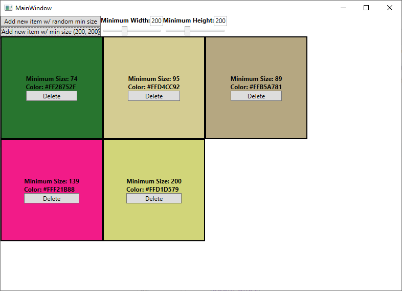

# GridPanel

`GridPanel` is a simple panel made to emulate *some* of the capabilities
of WinUI's `GridView` control ([docs](https://learn.microsoft.com/en-us/windows/windows-app-sdk/api/winrt/microsoft.ui.xaml.controls.gridview)).

The [demo project](GridPanelDemo) demonstrates this `Panel`:

1. The application starts with some five randomized items in the list.
   - Each item has a minimum size, in order to demonstrate the dynamic sizing of rows/columns
   - Each item has a color (simply to make it easier to distinguish from the other items)
   - Three items fit in the first row; the remaining two wrap into the second row
   
2. The largest item is removed
   - The row height has been adjusted - the new row height is the height of the largest item 
     that remains
   - Now, all four remaining items fit into the first row - a second row is no longer needed
     
3. A new item with a maximum size of 200x200 is added
   - The row height has been adjusted - Since the tallest item is now 200 pixels high, all rows 
     now have a height of 200 pixels.
   - With the new row height, only three items fit in the top row.
     
4. As new items are added, they overflow into new rows as needed.
   

# Usage

Simply replace the `ItemsPanelTemplate` of an `ItemsControl` with one using a `GridPanel`.

```xaml
<ListBox ItemsSource="{Binding Items}"
         SelectedItem="{Binding SelectedItem}">
    <ListBox.ItemsPanel>
        <ItemsPanelTemplate>
            <local:GridPanel />
        </ItemsPanelTemplate>
    </ListBox.ItemsPanel>
</ListBox>
```

You can technically use _any_ `ItemsControl`, but some types of `ItemsControl` aren't really 
designed for custom layout panels.  Your best bet is to use a `ListBox` if you want to allow
_selection_ (and bind to the `SelectedItem` property), or to just use a regular `ItemsControl` if
you want it to be a read-only view.


If you prefer, you can make a style:

```xaml
<Style TargetType="{x:Type ItemsControl}"
       BasedOn="{StaticResource {x:Type ItemsControl}}">
    <Setter Property="ItemsPanel">
        <Setter.Value>
            <ItemsPanelTemplate>
                <gridPanelDemo:GridPanel />
            </ItemsPanelTemplate>
        </Setter.Value>
    </Setter>
</Style>
```

# Differences from WinUI's implementation

My `GridPanel` is not a drop-in replacement for WinUI's `GridView` control - _nor
is it intended to be_.

- WinUI's `GridView` is a full-fledged `ListViewBase` control.  This means that it has _selection_
  capabilities out-of-the-box.  `GridPanel` does not.  `GridPanel` is intended to be used 
  _in conjunction with_ an existing `Selector` control, like `ListBox`
- WinUI's `GridView` gets much of its functionality from the `ItemsWrapGrid` panel
  ([docs](https://learn.microsoft.com/en-us/uwp/api/windows.ui.xaml.controls.itemswrapgrid))
  - `GridView`'s default `ItemsPanelTemplate` is `ItemsWrapGrid`
  - You could, in theory, use `ItemsWrapGrid` in other use cases.
- WinUI's `ItemsWrapGrid` has two additional capabilities:
  - `Orientation`
    - If `Horizontal`, it will fill each _row_ before starting a new _row_
    - If `Vertical`, it will fill each _column_ before starting a new _column_
    - The default for `ItemsWrapGrid` is `Vertical`, but `GridView` sets it to `Horizontal` by default
  - `MaximumRowsOrColumns` - this property controls the maximum number of rows or columns before wrapping
    - If `Orientation` is `Horizontal`, this controls the maximum number of _columns_
    - If `Orientation` is `Vertical`, this controls the maximum number of _rows_
    - The default is `-1`, which specifies no maximum
  - *I did not implement an equivalent for these properties*.  If you require these, feel 
    free to do any of the following
    - Submit an issue, requesting it.  I'll do it if I have time
    - Submit a PR, adding the capability
    - Add it on your own

